## Code challenge 1.

### Add JS files to the page via <head/> in layout XML

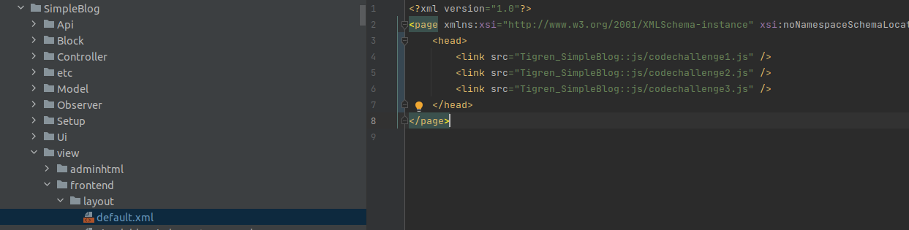

### Create a RequireJS config file and add global files using dep (AMD module) and shim (non AMD module, with dependency)

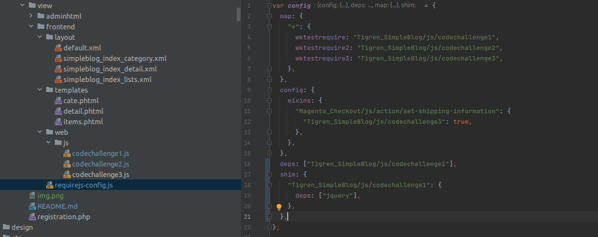

## Code challenge 2.

### Add a template via layout and use data-mage-init / x-magento-init to include a simple JS file that logs or alerts data

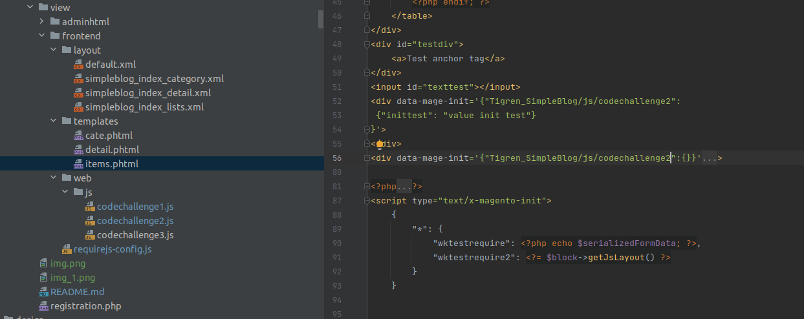
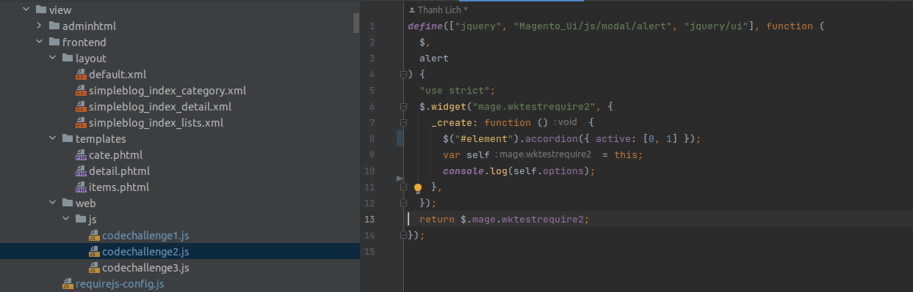
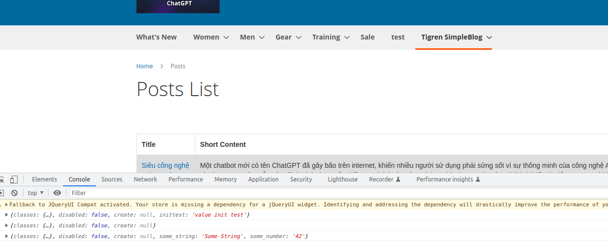

### Add an alias in a RequireJS config file and update the file call in the template

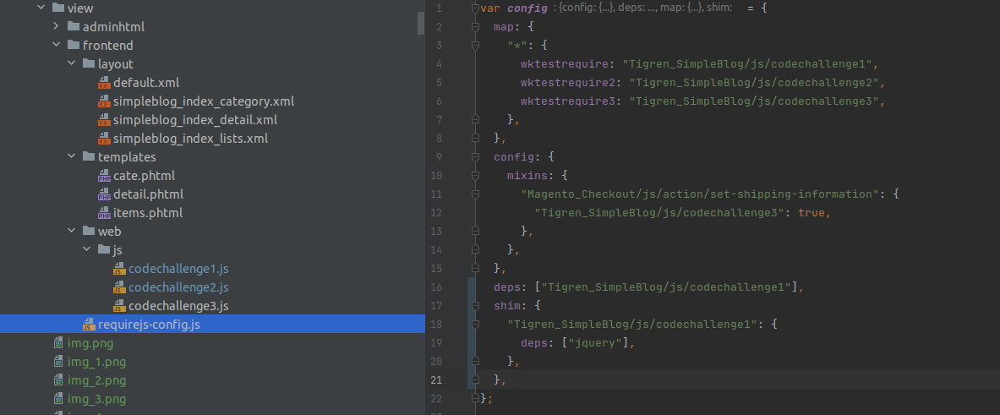
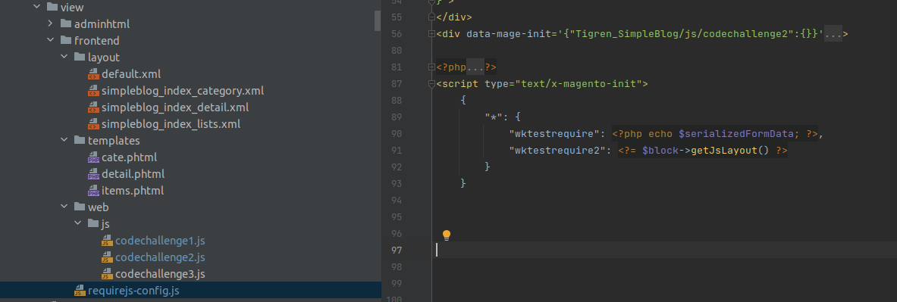

### Pass config data to your JS file via the template, then by layout using jsLayout

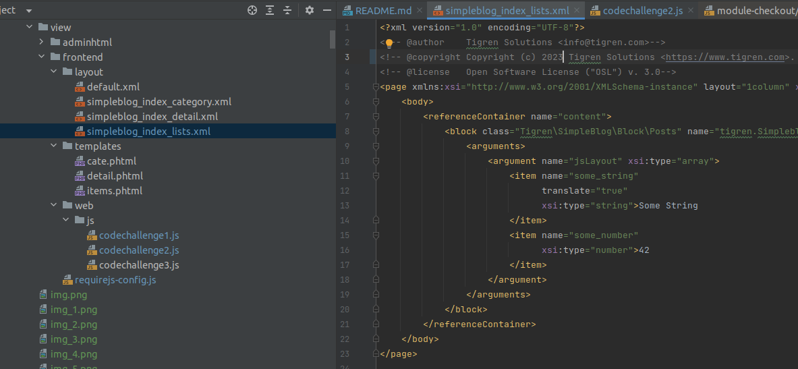
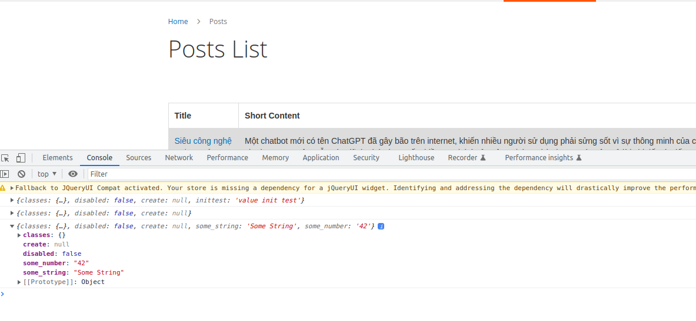

## Code challenge 3.

### Create a jQuery widget to perform a simple interaction on the page

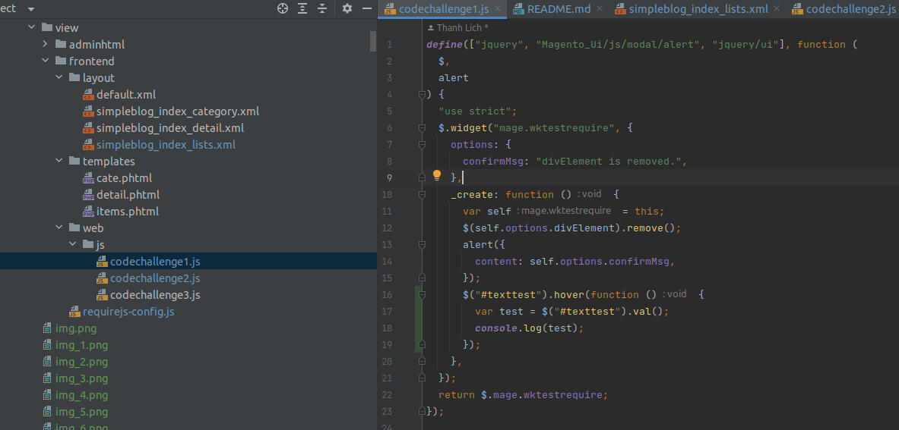
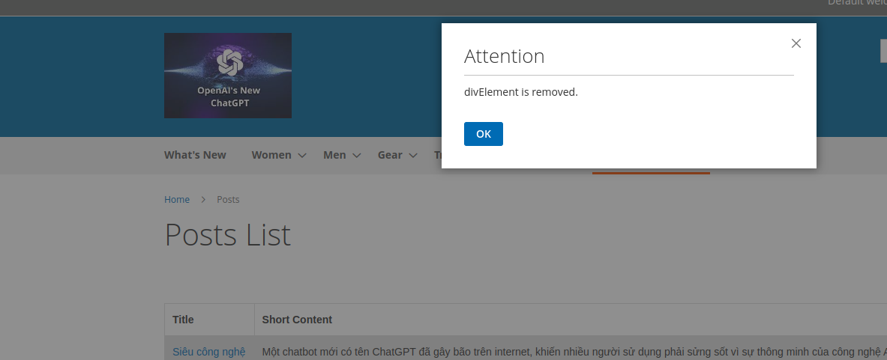

### Set default options and use data-role attributes to set default properties / roles to elements

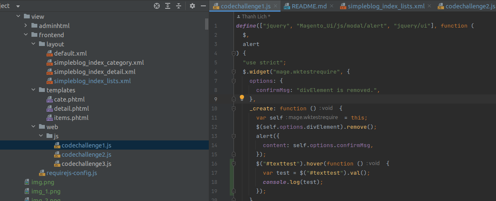
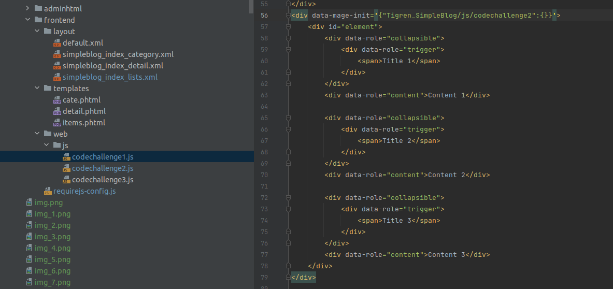
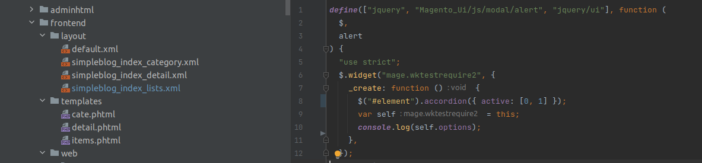
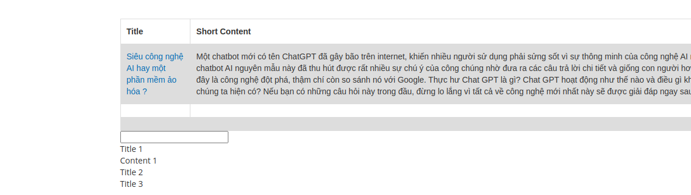

### Create a mixin for your widget to modify it’s functionality

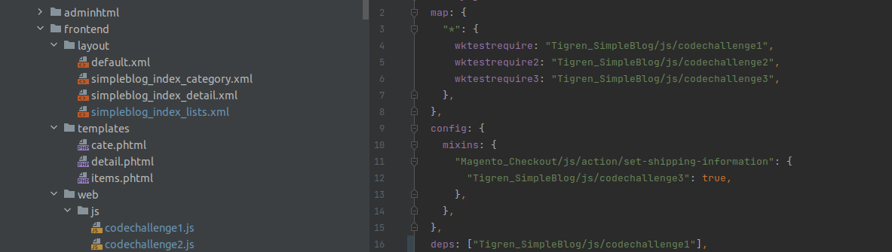
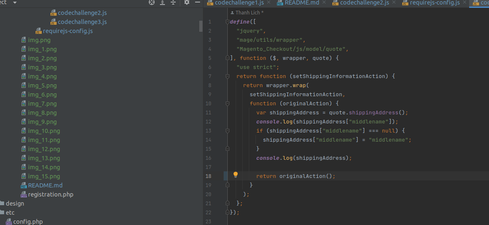
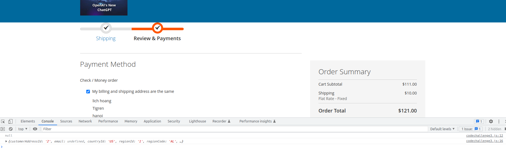

## Using modal

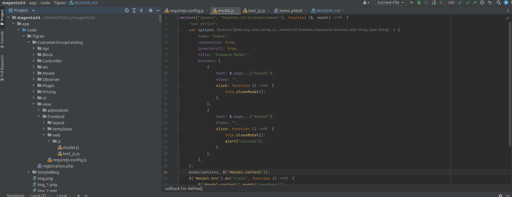
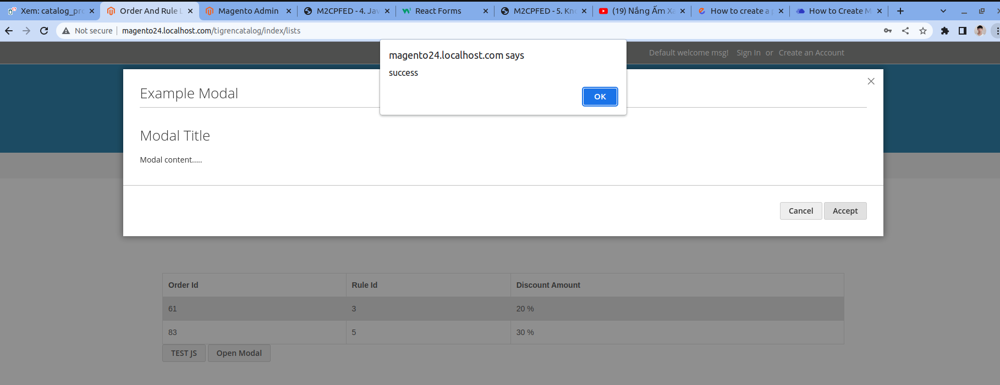
